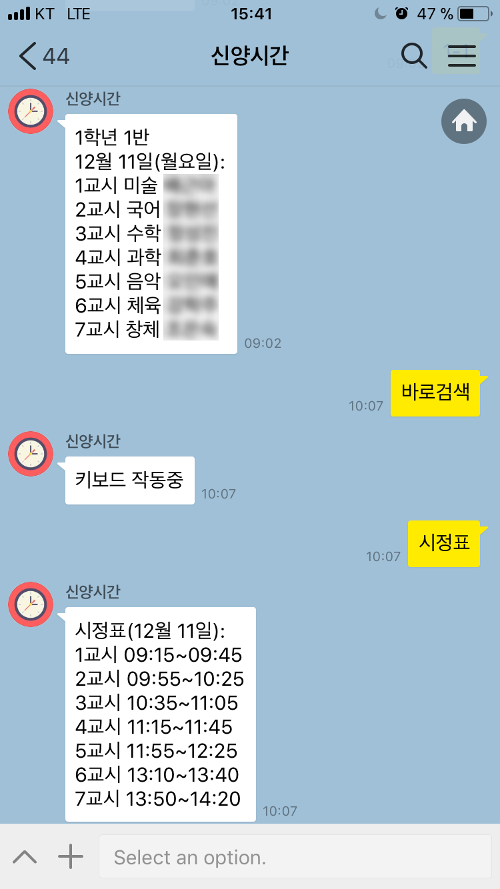

# Note
I don't provide this service anymore. This is an archived repository.

# Shinyangtime

I used [django](https://www.djangoproject.com/) and [Kakao's API](https://github.com/plusfriend/auto_reply) to let teachers in Shinyang middle school to see their timetable through querying in Kakaotalk.

The whole process consists of three steps:
1. User queries(Kakaotalk messages) => Server
2. Query processing
3. Server => User(Kakaotalk message)

Below is an example of this actually being used in Kakaotalk.

